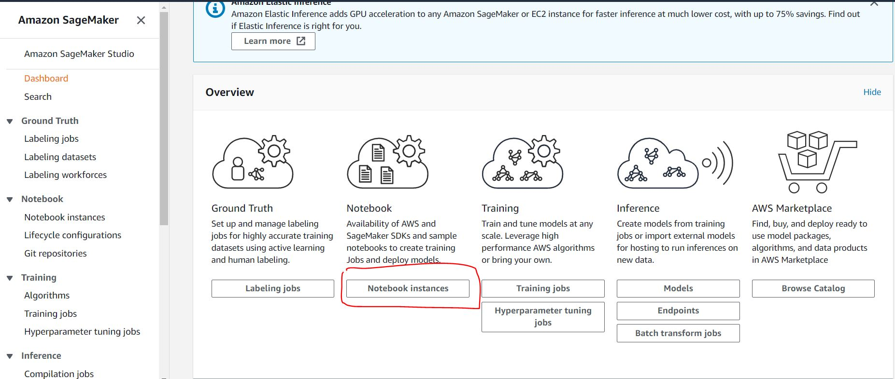
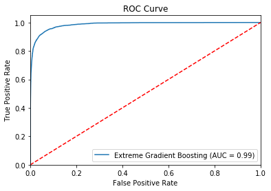
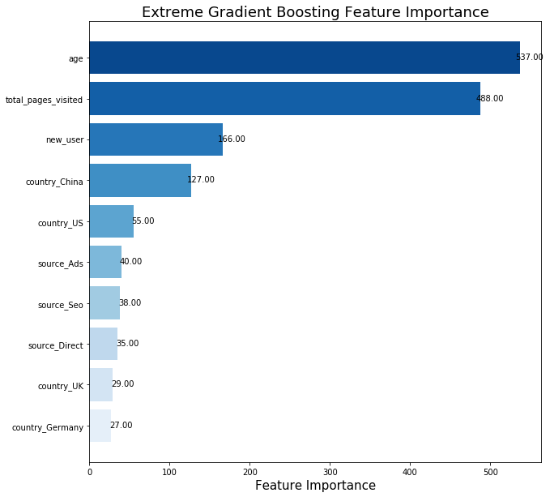

## Projects Overview

The object of this analysis is to develop a model for an e-commerce company that predicts user conversion rate using AWS’ Amazon SageMaker service, and in doing so identify important features in predicting user conversion. These insights will provide the foundation for a recommendation as to how best the company can increase its conversion rate.
 
 
Our task in this project was to produce a tool for assisting in selecting promising showroom locations based on predicted revenue for these locations output from a model that we created.

## Amason SageMaker
The analysis of the customer data was primarily done on AWS platform with SageMaker.AWS SageMaker a machine learning Integrated Development Environment (IDE) for building, training, and debugging models. In this analysis, I created a S3 bucket for data and model storage. In the SageMaker, I developed and trained my model using the pre-built XGBoost algorithm provided by AWS in a new Notebook Instance.

 
[Click here to view my model](/notebook/index.html)

## Results 

 
The model produced yielded an overall accuracy of 98.6%, along with a precision of 84.55% and recall of 68.47%, a strong performance. An additional metric used to assess the model was the Receiver Operator Characteristics, or ROC, curve. Specifically, the area under the curve (AUC) was evaluated. This value was calculated to be 0.9853, indicating the model is an excellent classifier.
 

 
The ‘feature importances’ were extracted from the trained model, and were used to identify the most important features in predicting user conversion. These results indicated user age and the number of pages visited were overwhelmingly the most significant predictors of user conversion. Other significant predictors included whether or not a user was new, and whether or not they were from China, although these effects were to a much lesser extent than age or number of pages visited. A final observation is that the marketing channel seemed to have very little effect on predicting user conversion.

## Recommendations

-	The site has high rates of success among young users. Marketing should advertise through a channel which is likely to reach young people. 
-	Users with old accounts have a higher conversion rate. Ways to bring them back to the site, such as targeted emails with offers could be a worthwhile idea. 
-	Something is wrong with the site reaching Chinese audiences. Perhaps this version is poorly translated or doesn’t fit the local culture. China is a very large market, so identifying the issue and fixing it should be a top priority. 
-	The site performs poorly among older users. From 30 years old and beyond, the conversion rate starts dropping noticeably. Perhaps an investigation into the UI would be worthwhile. 
-	Users who have visited many pages but have not converted likely have high purchase intent. These users are probably the easiest group to convert. Marketing could send them targeted emails with offers or reminders to encourage buying behavior.

